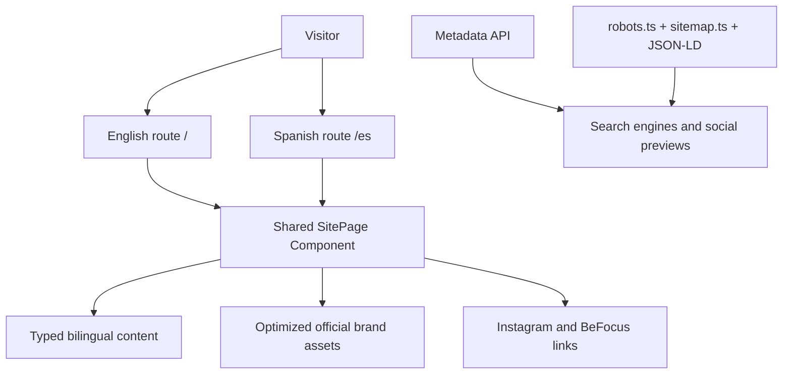

# Technical Specification

## 1. Objetivo

NewTalentt Website presenta la marca como una boutique privada e internacional de Music Strategy, Growth & Technology. La V1 es una landing de alto rendimiento, bilingüe y sin backend.

## 2. Arquitectura

La aplicación usa App Router y prerenderiza las dos rutas como HTML estático. El único Client Component contiene la navegación móvil y las animaciones; no consulta servicios externos ni guarda estado persistente.

## 3. Stack verificado

| Capa | Tecnología | Versión |
| --- | --- | --- |
| Framework | Next.js | 16.2.12 |
| UI runtime | React | 19.2.8 |
| Lenguaje | TypeScript | 5.9.3 |
| Estilos | Tailwind CSS | 4.3.3 |
| Motion | Motion for React | 12.43.0 |

La sintaxis y configuración se contrastaron con documentación actual de Next.js, Tailwind CSS y Motion mediante Context7.

## 4. Estructura

- `app/`: rutas, metadata y archivos SEO.
- `components/`: experiencia visual compartida.
- `content/`: copy tipado English/Spanish.
- `public/brand/`: assets oficiales optimizados.
- `assets/brand-source/`: originales de trabajo, excluidos del Deploy.
- `design-system/`: fuente de verdad visual.
- `docs/`: documentación viva.

## 5. Localización

- English: `/`
- Español: `/es`
- `hreflang`: `en`, `es` y `x-default`.
- Sitemap: ambas rutas incluyen alternates.
- El Client Component sincroniza `document.documentElement.lang` al navegar.
- El contenido principal conserva jerarquía semántica idéntica en ambos idiomas.

## 6. SEO

- Metadata API de Next.js.
- Canonical y alternates localizados.
- OpenGraph y Twitter card de 1200 × 630.
- `ProfessionalService` JSON-LD sin dirección ni datos inventados.
- `robots.ts`, `sitemap.ts` y `manifest.ts`.
- Headings secuenciales, landmarks y HTML semántico.

`SITE_URL` debe contener exclusivamente el origin HTTPS público para generar canonical, sitemap y
Schema.org correctos. La variable se valida durante el build y nunca se lee desde el Client
Component.

## 7. Performance

- Rutas prerenderizadas.
- Fuentes optimizadas con `next/font`.
- Assets WebP con dimensiones declaradas.
- Sin scripts de terceros, embeds, tracking ni video autoplay.
- Motion limitado a `transform` y `opacity`.
- No se carga contenido remoto durante la navegación.

## 8. Accesibilidad

- Objetivo WCAG 2.2 AA.
- Skip link y focus visible.
- Touch targets mínimos de 44 px.
- Menú móvil operable por teclado y cerrable con `Escape`.
- Contraste alto en dark y light sections.
- `prefers-reduced-motion` aplicado en CSS y Motion.
- Contenido decorativo fuera del árbol accesible.
- No se comunica significado únicamente con color.

## 9. Seguridad

La V1 no acepta entradas, no usa autenticación y no procesa datos personales. Por tanto, se evita un backend innecesario.

Cabeceras:

- Content Security Policy.
- `X-Content-Type-Options: nosniff`.
- `X-Frame-Options: DENY`.
- `Referrer-Policy: strict-origin-when-cross-origin`.
- Permissions Policy restrictiva.
- Cross-Origin Opener Policy.
- HSTS con preload.
- CSP reforzada con bloqueo de objects, frames y manifests externos.
- Overrides auditados para mantener PostCSS, Sharp y dependencias del toolchain en versiones corregidas.

## 10. CI/CD

GitHub Actions ejecuta sobre Node.js 24:

- instalación reproducible con `npm ci`;
- typecheck, lint, unit tests y production build;
- `npm audit` con bloqueo desde severidad alta sobre el dependency graph completo.

Vercel debe conservar los comandos detectados para Next.js y definir `SITE_URL` tanto en Preview
como en Production.

Reglas futuras:

- Validar entradas con Zod antes de usarlas.
- Guardar secretos únicamente en variables de entorno server-side.
- No exponer secretos con el prefijo `NEXT_PUBLIC_`.
- Usar HTTPS en producción.
- Si aparece persistencia, diseñar RLS y autorización antes de crear tablas.

## 11. Claims y atribución

- BeFocus Music: crecimiento aproximado desde 500 a más de 140K suscriptores en aproximadamente 18 meses.
- Las Ganas: contribución de estrategia y lanzamiento a un release certificado por RIAA.
- El texto aclara expresamente que no implica management ni representación.

No se añaden resultados, clientes o relaciones no aprobadas.
